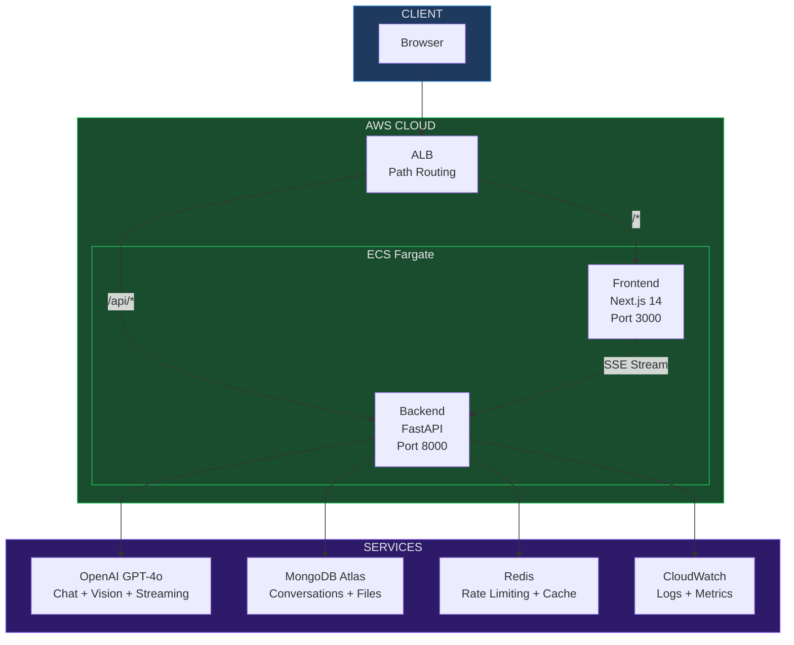
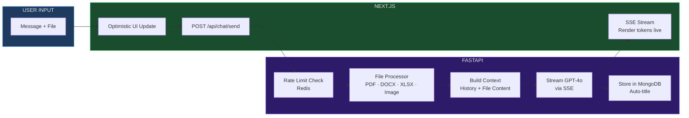

<div align="center">

# Conversa AI | by AiwithDhruv

### ChatGPT-like app with multi-modal file support — built and deployed from scratch.


Upload PDFs, images, Word docs, Excel sheets — ask questions about them.
Stream AI responses in real-time. Full conversation history. Deployed on AWS with CI/CD.

**Built and deployed in one session with Claude Code.**

<br />


<br />

[Live Demo](#live-demo) · [Features](#features) · [Quick Start](#quick-start) · [Architecture](#architecture) · [Deployment](#deployment)

</div>

---

## Live Demo

| | |
|---|---|
| **GitHub** | [github.com/aiagentwithdhruv/conversa-ai](https://github.com/aiagentwithdhruv/conversa-ai) |
| **Live App** | Deployed on AWS ECS Fargate (ALB + auto-deploy on push) |
| **API Docs** | `/docs` — interactive Swagger UI |

---

## Features

| Feature | What It Does |
|:---|:---|
| **AI Chat** | GPT-4o powered conversations with streaming responses (SSE) |
| **PDF Analysis** | Upload a PDF → AI reads and answers questions about it |
| **Image Understanding** | Upload an image → GPT-4o Vision describes and analyzes it |
| **Word & Excel** | Upload DOCX/XLSX → extracted text becomes AI context |
| **Conversation History** | Auto-titled conversations saved in MongoDB, searchable sidebar |
| **Code Highlighting** | AI code responses with syntax highlighting + copy button |
| **Rate Limiting** | Redis-backed per-IP rate limiting (configurable) |
| **Production Infra** | AWS ECS Fargate + ALB + ECR + CloudWatch + GitHub Actions CI/CD |

---

## Screenshots

### Chat Interface — Code Generation with Syntax Highlighting


> Real-time token streaming via Server-Sent Events. Markdown rendering with syntax-highlighted code blocks. Conversation history in sidebar.

### Image Analysis — GPT-4o Vision


> Upload any image — GPT-4o Vision analyzes it and extracts structured data. Full multi-modal support.

---

## Quick Start

```bash
# Clone
git clone https://github.com/aiagentwithdhruv/conversa-ai.git
cd conversa-ai

# Configure
cp .env.example .env
# Add your OPENAI_API_KEY

# Run
docker-compose up --build
```

```
Frontend  →  http://localhost:3000
API Docs  →  http://localhost:8000/docs
Health    →  http://localhost:8000/health
```

**3 commands. Full-stack AI chat running locally.**

---

## Architecture



### Request Flow



---

## Tech Stack

| Layer | Technology |
|:---|:---|
| **Frontend** | Next.js 14 (App Router), TypeScript, Tailwind CSS, react-markdown |
| **Backend** | FastAPI (Python 3.11), OpenAI SDK, Motor (async MongoDB), SSE-Starlette |
| **Database** | MongoDB Atlas (conversations + messages + file metadata) |
| **Cache** | Redis (rate limiting + session cache) |
| **File Processing** | pdfplumber, python-docx, openpyxl, Pillow (base64 for Vision) |
| **AI** | OpenAI GPT-4o (text + vision + streaming) |
| **Infrastructure** | Docker, AWS ECS Fargate, ALB, ECR, ElastiCache, CloudWatch |
| **CI/CD** | GitHub Actions — push to main → build → ECR → ECS (zero-downtime) |
| **Monitoring** | Grafana dashboards, CloudWatch logs + metrics |

---

## API Endpoints

| Method | Path | Description |
|:---|:---|:---|
| `POST` | `/api/chat/send` | Chat + file upload (SSE streaming) |
| `POST` | `/api/chat/send-simple` | Chat without streaming |
| `GET` | `/api/conversations` | List all conversations |
| `GET` | `/api/conversations/:id` | Get conversation details |
| `GET` | `/api/conversations/:id/messages` | Get messages |
| `PATCH` | `/api/conversations/:id` | Update title |
| `DELETE` | `/api/conversations/:id` | Delete conversation |
| `GET` | `/api/files/:id` | File metadata |
| `GET` | `/api/files/:id/download` | Download file |
| `GET` | `/api/files/:id/text` | Get extracted text |
| `GET` | `/health` | Health check (DB + Redis) |

---

## Deployment

### CI/CD Pipeline


Every push to `main` triggers automatic deployment with zero downtime.

### GitHub Actions Secrets Required

| Secret | Description |
|:---|:---|
| `AWS_ACCESS_KEY_ID` | IAM user access key |
| `AWS_SECRET_ACCESS_KEY` | IAM user secret key |

### AWS Infrastructure

| Service | Purpose |
|:---|:---|
| **ECS Fargate** | Serverless container hosting (frontend + backend) |
| **ALB** | Load balancer with path-based routing (`/api/*` → backend, `/*` → frontend) |
| **ECR** | Container image registry |
| **CloudWatch** | Application logs and metrics |
| **ElastiCache** | Managed Redis for rate limiting |
| **MongoDB Atlas** | Managed database (external) |

### Manual Deployment

```bash
# Setup entire AWS infrastructure
chmod +x infrastructure/setup-aws.sh
./infrastructure/setup-aws.sh
```

---

## Project Structure

```
conversa-ai/
├── backend/
│   ├── app/
│   │   ├── main.py              # FastAPI app + health check
│   │   ├── config.py            # Pydantic settings
│   │   ├── api/
│   │   │   ├── chat.py          # SSE streaming chat endpoint
│   │   │   ├── conversations.py # Conversation CRUD
│   │   │   └── files.py         # File operations
│   │   ├── services/
│   │   │   ├── openai_service.py   # GPT-4o + Vision
│   │   │   ├── file_processor.py   # PDF/DOCX/XLSX/Image
│   │   │   ├── mongo_service.py    # Async MongoDB
│   │   │   └── redis_service.py    # Rate limiting
│   │   └── models/
│   │       └── schemas.py       # Request/response models
│   ├── Dockerfile
│   └── requirements.txt
│
├── frontend/
│   ├── src/
│   │   ├── app/                 # Next.js App Router
│   │   ├── components/
│   │   │   ├── Sidebar.tsx      # Conversation list
│   │   │   ├── ChatArea.tsx     # Message display
│   │   │   ├── ChatMessage.tsx  # Markdown + code blocks
│   │   │   ├── ChatInput.tsx    # Auto-resize input
│   │   │   └── FileUpload.tsx   # Drag-and-drop upload
│   │   ├── lib/
│   │   │   └── api.ts           # API client + SSE parser
│   │   └── types/
│   │       └── index.ts         # TypeScript interfaces
│   ├── Dockerfile
│   └── package.json
│
├── infrastructure/
│   ├── task-definition.json     # ECS task (2 containers)
│   └── setup-aws.sh            # AWS setup script
│
├── grafana/
│   └── dashboard.json          # Monitoring dashboards
│
├── .github/workflows/
│   └── deploy.yml              # CI/CD pipeline
│
├── docker-compose.yml          # Local dev (4 containers)
└── README.md
```

---

## Environment Variables

```env
# Required
OPENAI_API_KEY=sk-...

# MongoDB
MONGODB_URI=mongodb://localhost:27017
MONGODB_DB_NAME=conversa_ai

# Redis
REDIS_URL=redis://localhost:6379

# App Config
CORS_ORIGINS=["http://localhost:3000"]
RATE_LIMIT_PER_MINUTE=20
MAX_FILE_SIZE_MB=10

# Frontend
NEXT_PUBLIC_API_URL=http://localhost:8000
```

---

## Euron Bootcamp

This project is a reference implementation for the **Future-Proof AI Automation Bootcamp** at [Euron](https://euron.one).

| Phase | Topic | Conversa AI Coverage |
|:---|:---|:---|
| Phase 4 (Week 9) | RAG + Chatbot | Chat + file processing + context building |
| Phase 5 (Week 11-12) | Docker + Deployment | Docker Compose, ECS Fargate, CI/CD |
| Phase 7 (Week 15-17) | Full-Stack AI Capstone | Complete production app |

---

<div align="center">

### Built by [Dhruv Tomar](https://linkedin.com/in/aiwithdhruv) — @AIwithDhruv

Applied AI Engineer & Solutions Architect | Euron Instructor

**Built and deployed in one session. No tutorials. No copy-paste.**

MIT License

</div>
